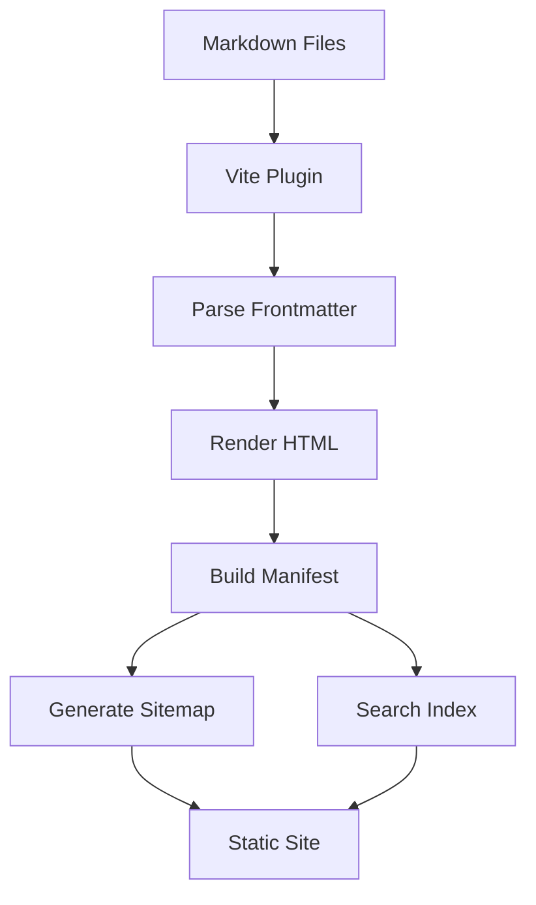
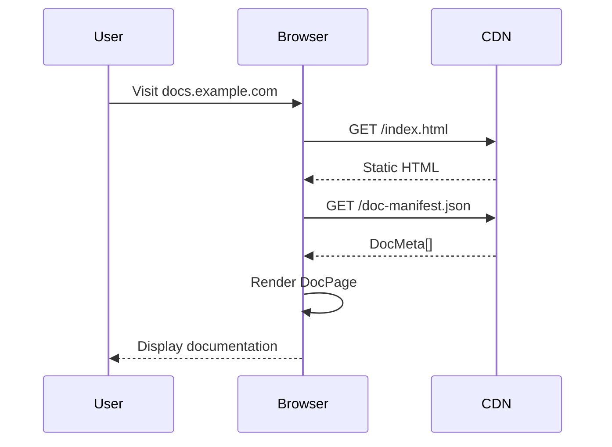

# Markdown Features

> **📖 Showcase Page** — This page showcases all Markdown features supported by EasyDoc's markdown-it pipeline. For configuration options, see [Configuration](/en/getting-started/configuration).

EasyDoc supports a rich set of markdown features through GitHub Flavored Markdown (GFM) and additional plugins. This page showcases everything you can do.

## Text Formatting

### Basic Inline Styles

You can apply **bold**, *italic*, ~~strikethrough~~, `inline code`, and <u>underline</u> formatting to your text. You can also combine them: ***bold and italic***, or **bold with ~~strikethrough~~**.

### Links and Images

[Internal links](/en/getting-started/getting-started) use relative paths. [External links](https://example.com) open in a new tab.


### Emoji Support

EasyDoc supports emoji shortcodes: :rocket: :sparkles: :books: :gear: :memo:

## Headings

Headings create the document structure and automatically populate the right-side Table of Contents.

### Heading Level 3
#### Heading Level 4
##### Heading Level 5
###### Heading Level 6

## Code Blocks

### Syntax Highlighting

Code blocks support syntax highlighting for many languages. Use triple backticks with a language identifier:

```typescript
// TypeScript example with generic types
interface ApiResponse<T> {
  data: T;
  status: number;
  message: string;
  timestamp: Date;
}

async function fetchData<T>(url: string): Promise<ApiResponse<T>> {
  const response = await fetch(url);
  if (!response.ok) {
    throw new Error(`HTTP error! status: ${response.status}`);
  }
  return response.json();
}

// Usage with type inference
const userData = await fetchData<User>('/api/users/1');
console.log(userData.data.name);
```

### Python

```python
# Python example with async/await
import asyncio
from typing import Optional, List
from dataclasses import dataclass

@dataclass
class Document:
    title: str
    content: str
    tags: List[str] = None

    def word_count(self) -> int:
        return len(self.content.split())

async def process_documents(docs: List[Document]) -> List[int]:
    tasks = [asyncio.to_thread(doc.word_count) for doc in docs]
    return await asyncio.gather(*tasks)

# Run the async function
counts = asyncio.run(process_documents([
    Document("First", "Hello world"),
    Document("Second", "Python is awesome for documentation")
]))
print(f"Word counts: {counts}")
```

```rust
// Rust example with pattern matching
use std::collections::HashMap;

#[derive(Debug)]
enum DocEvent {
    Created { path: String, title: String },
    Updated { path: String, changes: Vec<String> },
    Deleted { path: String },
}

impl DocEvent {
    fn describe(&self) -> String {
        match self {
            DocEvent::Created { path, title } =>
                format!("Created '{}' at {}", title, path),
            DocEvent::Updated { path, changes } =>
                format!("Updated {} with {} changes", path, changes.len()),
            DocEvent::Deleted { path } =>
                format!("Deleted {}", path),
        }
    }
}

fn main() {
    let event = DocEvent::Created {
        path: String::from("docs/guide/rust.md"),
        title: String::from("Rust Guide"),
    };
    println!("{}", event.describe());
}
```

```bash
#!/bin/bash
# Shell script showing common documentation workflow

set -euo pipefail

DOCS_DIR="docs"
BUILD_DIR="dist"

echo "🔍 Scanning documentation files..."
find "$DOCS_DIR" -name "*.md" | while read -r file; do
    title=$(grep "^# " "$file" | head -1 | sed 's/^# //')
    lines=$(wc -l < "$file")
    echo "  📄 $file — \"$title\" ($lines lines)"
done

echo "📦 Building documentation site..."
pnpm run build

echo "✅ Build complete! Output in $BUILD_DIR/"
```

### Line Highlighting

You can highlight specific lines in code blocks:

```typescript {2,4-6}
function greet(name: string): string {
  // This line is highlighted
  const greeting = `Hello, ${name}!`;
  // These lines
  // are also
  // highlighted
  return greeting;
}
```

### Diff View

Show code changes with diff syntax highlighting:

```diff
- const OLD_API_URL = 'https://api-v1.example.com';
+ const API_URL = 'https://api-v2.example.com';

  export async function fetchDocs(): Promise<DocMeta[]> {
-   const response = await fetch(`${OLD_API_URL}/docs`);
+   const response = await fetch(`${API_URL}/docs`, {
+     headers: { 'X-API-Version': '2.0' },
+   });
    return response.json();
  }
```

## Tables

### Basic Table

| Feature | Status | Priority | Release |
|---------|--------|----------|---------|
| Markdown parsing | ✅ Complete | P0 | v1.0.0 |
| Syntax highlighting | ✅ Complete | P0 | v1.0.0 |
| Full-text search | ✅ Complete | P1 | v1.0.0 |
| Dark mode | ✅ Complete | P1 | v1.0.0 |
| Plugin system | 🚧 In Progress | P2 | v1.1.0 |
| i18n support | 📋 Planned | P3 | v1.2.0 |

### Alignment

| Left Aligned | Center Aligned | Right Aligned |
|:-------------|:--------------:|--------------:|
| Content | 42 | $100.00 |
| Longer content here | 7 | $1.99 |
| Short | 365 | $999.99 |

### Complex Table

| Method | Signature | Returns | Throws |
|--------|-----------|---------|--------|
| `fetchDocManifest` | `() => Promise<DocMeta[]>` | `DocMeta[]` | `FetchError` |
| `buildDocTree` | `(docs: DocMeta[]) => DocTreeNode[]` | `DocTreeNode[]` | Never |
| `parseFrontmatter` | `(raw: string) => DocFrontmatter` | `DocFrontmatter` | `ParseError` |

## Lists

### Unordered Lists

- First level item
  - Second level item
    - Third level item
      - Fourth level item
- Another first level item
  - With a second level child

### Ordered Lists

1. Step one: Install dependencies
2. Step two: Configure the site
   1. Sub-step: Set site metadata
   2. Sub-step: Configure navigation
3. Step three: Write documentation
4. Step four: Build and deploy

### Task Lists

- [x] Install EasyDoc
- [x] Create first documentation page
- [ ] Add custom theme
- [ ] Configure search
- [ ] Deploy to production

### Definition Lists

**EasyDoc**
: A static documentation site generator built with React and Vite.

**Frontmatter**
: YAML metadata at the beginning of a markdown file, enclosed by `---` delimiters.

**DocTreeNode**
: A recursive data structure representing a file or folder in the documentation sidebar.

## Blockquotes

### Simple Blockquote

> EasyDoc makes documentation a first-class citizen of your project. Write in markdown, ship a beautiful site.

### Nested Blockquotes

> This is a top-level quote.
>> This is a nested quote.
>>> This quote is three levels deep.
>
> Back to the top level.

### Blockquote with Attribution

> The best documentation is the one that gets written. EasyDoc removes all the friction.
>
> — *EasyDoc Team*

## Callouts / Admonitions

You can create callout-style blocks using blockquotes with emoji prefixes. EasyDoc's markdown-it pipeline renders these as styled blockquotes — no dedicated callout plugin is required:

> **ℹ️ Note:** This is an informational note. It provides context or additional details.

> **✅ Tip:** Use `pnpm run dev -- --open` to automatically open the browser when starting the dev server.

> **⚠️ Warning:** Always run `pnpm run build` before deploying to catch any build errors.

> **🚫 Danger:** Never edit files in the `dist/` directory directly. They are overwritten on every build.

## Horizontal Rules

Use three or more dashes, asterisks, or underscores:

---

## Mathematical Notation

EasyDoc supports LaTeX math expressions inline: $E = mc^2$ and as display blocks:

$$
\sum_{n=1}^{\infty} \frac{1}{n^2} = \frac{\pi^2}{6}
$$

$$
f(x) = \int_{-\infty}^{\infty} \hat{f}(\xi) e^{2\pi i \xi x} d\xi
$$

```math
\begin{bmatrix}
a_{11} & a_{12} & a_{13} \\
a_{21} & a_{22} & a_{23} \\
a_{31} & a_{32} & a_{33}
\end{bmatrix}
```

## Footnotes

EasyDoc supports footnotes with automatic numbering[^1].

You can have multiple footnotes on a page[^2], and they all render at the bottom.

[^1]: This is the first footnote. It can contain **markdown** and [links](#).

[^2]: Here's another footnote with `inline code` and more text.

## Mermaid Diagrams

Flowcharts, sequence diagrams, and more:





## HTML in Markdown

When you need more control, you can use raw HTML:

<div style="background: linear-gradient(135deg, #667eea 0%, #764ba2 100%); padding: 1.5rem; border-radius: 0.5rem; color: white;">
  <h3 style="margin-top: 0;">Custom HTML Block</h3>
  <p>This block uses <strong>inline styles</strong> for a gradient background — great for special callouts or promotional sections.</p>
</div>

<details>
<summary>Click to expand — Collapsible Section</summary>

This content is hidden by default and revealed when the user clicks the summary. Great for optional details, FAQs, or spoiler content.

```typescript
const hidden = 'This code was inside a collapsed section';
```

</details>

## Combining Features

You can nest and combine features for rich content:

> ### 💡 Pro Tip: Organizing Large Documentation Sets
>
> For projects with 50+ documentation pages, consider this structure:
>
> | Directory | Purpose | Example |
> |-----------|---------|---------|
> | `docs/guide/` | Tutorials & getting started | `installation.md` |
> | `docs/concepts/` | Architecture & design decisions | `data-flow.md` |
> | `docs/api/` | API reference | `authentication.md` |
> | `docs/examples/` | Code examples & recipes | `react-hooks.md` |
>
> Each directory gets its own `index.md` as a landing page. Use `order` frontmatter to control the sidebar sequence:
>
> ```yaml
> ---
> title: 'API Reference'
> description: 'Complete API documentation'
> order: 30
> ---
> ```

---

You've now seen all the markdown features EasyDoc supports. For configuration details, see [Configuration](/en/getting-started/configuration). For getting started, head to [Getting Started](/en/getting-started/getting-started).