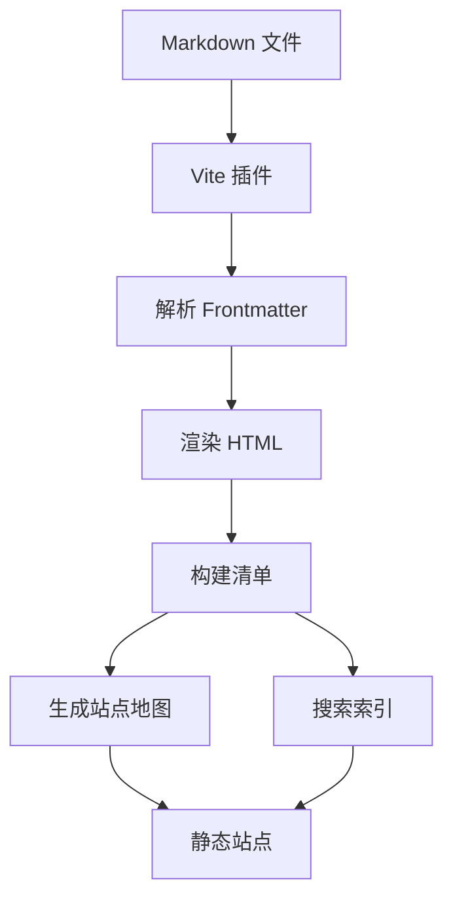
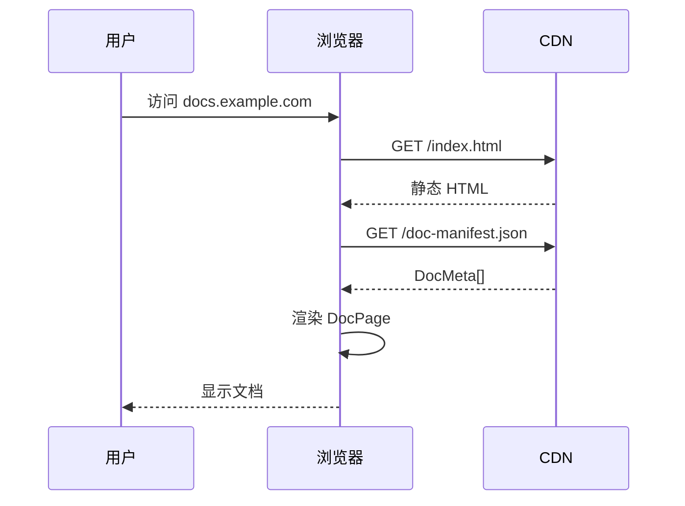

# Markdown 功能展示

> **📖 功能展示页面** — 本页面展示了 EasyDoc markdown-it 管线支持的所有 Markdown 功能。配置选项请参见 [配置](/zh/getting-started/configuration)。

EasyDoc 通过 GitHub Flavored Markdown (GFM) 及额外插件，支持丰富的 Markdown 功能集。本页面展示所有可用功能。

## 文本格式

### 基本内联样式

您可以为文本应用**粗体**、*斜体*、~~删除线~~、`行内代码` 和 <u>下划线</u> 格式。也可以组合使用：***粗斜体***，或 **粗体带 ~~删除线~~**。

### 链接与图片

[内部链接](/zh/getting-started/getting-started) 使用相对路径。[外部链接](https://example.com) 会在新标签页中打开。


### Emoji 支持

EasyDoc 支持 emoji 短代码：:rocket: :sparkles: :books: :gear: :memo:

## 标题

标题构建文档结构，并自动填充右侧目录。

### 三级标题
#### 四级标题
##### 五级标题
###### 六级标题

## 代码块

### 语法高亮

代码块支持多种语言的语法高亮。使用三个反引号加语言标识符：

```typescript
// TypeScript example with generic types
interface ApiResponse<T> {
  data: T;
  status: number;
  message: string;
  timestamp: Date;
}

async function fetchData<T>(url: string): Promise<ApiResponse<T>> {
  const response = await fetch(url);
  if (!response.ok) {
    throw new Error(`HTTP error! status: ${response.status}`);
  }
  return response.json();
}

// Usage with type inference
const userData = await fetchData<User>('/api/users/1');
console.log(userData.data.name);
```

### Python

```python
# Python example with async/await
import asyncio
from typing import Optional, List
from dataclasses import dataclass

@dataclass
class Document:
    title: str
    content: str
    tags: List[str] = None

    def word_count(self) -> int:
        return len(self.content.split())

async def process_documents(docs: List[Document]) -> List[int]:
    tasks = [asyncio.to_thread(doc.word_count) for doc in docs]
    return await asyncio.gather(*tasks)

# Run the async function
counts = asyncio.run(process_documents([
    Document("First", "Hello world"),
    Document("Second", "Python is awesome for documentation")
]))
print(f"Word counts: {counts}")
```

```rust
// Rust example with pattern matching
use std::collections::HashMap;

#[derive(Debug)]
enum DocEvent {
    Created { path: String, title: String },
    Updated { path: String, changes: Vec<String> },
    Deleted { path: String },
}

impl DocEvent {
    fn describe(&self) -> String {
        match self {
            DocEvent::Created { path, title } =>
                format!("Created '{}' at {}", title, path),
            DocEvent::Updated { path, changes } =>
                format!("Updated {} with {} changes", path, changes.len()),
            DocEvent::Deleted { path } =>
                format!("Deleted {}", path),
        }
    }
}

fn main() {
    let event = DocEvent::Created {
        path: String::from("docs/guide/rust.md"),
        title: String::from("Rust Guide"),
    };
    println!("{}", event.describe());
}
```

```bash
#!/bin/bash
# Shell script showing common documentation workflow

set -euo pipefail

DOCS_DIR="docs"
BUILD_DIR="dist"

echo "🔍 Scanning documentation files..."
find "$DOCS_DIR" -name "*.md" | while read -r file; do
    title=$(grep "^# " "$file" | head -1 | sed 's/^# //')
    lines=$(wc -l < "$file")
    echo "  📄 $file — \"$title\" ($lines lines)"
done

echo "📦 Building documentation site..."
pnpm run build

echo "✅ Build complete! Output in $BUILD_DIR/"
```

### 行高亮

您可以在代码块中高亮特定行：

```typescript {2,4-6}
function greet(name: string): string {
  // This line is highlighted
  const greeting = `Hello, ${name}!`;
  // These lines
  // are also
  // highlighted
  return greeting;
}
```

### 差异视图

使用 diff 语法高亮显示代码变更：

```diff
- const OLD_API_URL = 'https://api-v1.example.com';
+ const API_URL = 'https://api-v2.example.com';

  export async function fetchDocs(): Promise<DocMeta[]> {
-   const response = await fetch(`${OLD_API_URL}/docs`);
+   const response = await fetch(`${API_URL}/docs`, {
+     headers: { 'X-API-Version': '2.0' },
+   });
    return response.json();
  }
```

## 表格

### 基本表格

| 功能 | 状态 | 优先级 | 版本 |
|---------|--------|----------|---------|
| Markdown 解析 | ✅ 已完成 | P0 | v1.0.0 |
| 语法高亮 | ✅ 已完成 | P0 | v1.0.0 |
| 全文搜索 | ✅ 已完成 | P1 | v1.0.0 |
| 深色模式 | ✅ 已完成 | P1 | v1.0.0 |
| 插件系统 | 🚧 开发中 | P2 | v1.1.0 |
| 国际化支持 | 📋 计划中 | P3 | v1.2.0 |

### 对齐方式

| 左对齐 | 居中对齐 | 右对齐 |
|:-------------|:--------------:|--------------:|
| 内容 | 42 | $100.00 |
| 更长的内容在这里 | 7 | $1.99 |
| 短 | 365 | $999.99 |

### 复杂表格

| 方法 | 签名 | 返回值 | 异常 |
|--------|-----------|---------|--------|
| `fetchDocManifest` | `() => Promise<DocMeta[]>` | `DocMeta[]` | `FetchError` |
| `buildDocTree` | `(docs: DocMeta[]) => DocTreeNode[]` | `DocTreeNode[]` | 无 |
| `parseFrontmatter` | `(raw: string) => DocFrontmatter` | `DocFrontmatter` | `ParseError` |

## 列表

### 无序列表

- 第一层列表项
  - 第二层列表项
    - 第三层列表项
      - 第四层列表项
- 另一个第一层列表项
  - 带第二层子项

### 有序列表

1. 第一步：安装依赖
2. 第二步：配置站点
   1. 子步骤：设置站点元数据
   2. 子步骤：配置导航
3. 第三步：编写文档
4. 第四步：构建并部署

### 任务列表

- [x] 安装 EasyDoc
- [x] 创建第一个文档页面
- [ ] 添加自定义主题
- [ ] 配置搜索
- [ ] 部署到生产环境

### 定义列表

**EasyDoc**
: 一款基于 React 和 Vite 构建的静态文档站点生成器。

**Frontmatter**
: Markdown 文件开头的 YAML 元数据，由 `---` 分隔符包裹。

**DocTreeNode**
: 一种递归数据结构，代表文档侧边栏中的文件或文件夹。

## 引用

### 简单引用

> EasyDoc 让文档成为项目的一等公民。用 Markdown 编写，输出精美的站点。

### 嵌套引用

> 这是一个顶层引用。
>> 这是一个嵌套引用。
>>> 这个引用嵌套了三层。
>
> 回到顶层。

### 带署名的引用

> 最好的文档就是被写出来的文档。EasyDoc 消除了所有阻力。
>
> —— *EasyDoc 团队*

## 提示框

您可以使用带有 emoji 前缀的引用块来创建提示框式的内容块。EasyDoc 的 markdown-it 管线会将这些渲染为带样式的引用块——无需专用的提示框插件：

> **ℹ️ 注意：** 这是一条提示信息。用于提供上下文或补充说明。

> **✅ 提示：** 使用 `pnpm run dev -- --open` 可在启动开发服务器时自动打开浏览器。

> **⚠️ 警告：** 部署前务必运行 `pnpm run build` 以捕获构建错误。

> **🚫 危险：** 切勿直接编辑 `dist/` 目录中的文件。每次构建时它们都会被覆盖。

## 分隔线

使用三个或以上的连字符、星号或下划线：

---

## 数学公式

EasyDoc 支持 LaTeX 数学表达式，可内联使用：$E = mc^2$，也可作为显示块：

$$
\sum_{n=1}^{\infty} \frac{1}{n^2} = \frac{\pi^2}{6}
$$

$$
f(x) = \int_{-\infty}^{\infty} \hat{f}(\xi) e^{2\pi i \xi x} d\xi
$$

```math
\begin{bmatrix}
a_{11} & a_{12} & a_{13} \\
a_{21} & a_{22} & a_{23} \\
a_{31} & a_{32} & a_{33}
\end{bmatrix}
```

## 脚注

EasyDoc 支持自动编号的脚注[^1]。

您可以在一个页面上添加多个脚注[^2]，它们都会在页面底部渲染。

[^1]: 这是第一个脚注。它可以包含 **markdown** 和 [链接](#)。

[^2]: 这是另一个脚注，带有 `行内代码` 和更多文本。

## Mermaid 图表

流程图、时序图等：





## Markdown 中的 HTML

当需要更多控制时，您可以使用原生 HTML：

<div style="background: linear-gradient(135deg, #667eea 0%, #764ba2 100%); padding: 1.5rem; border-radius: 0.5rem; color: white;">
  <h3 style="margin-top: 0;">自定义 HTML 块</h3>
  <p>此块使用<strong>内联样式</strong>实现渐变背景——非常适合特殊提示或推广区域。</p>
</div>

<details>
<summary>点击展开 — 可折叠区域</summary>

此内容默认隐藏，用户点击摘要后显示。适用于可选详情、常见问题解答或剧透内容。

```typescript
const hidden = '这段代码位于折叠区域内';
```

</details>

## 组合功能

您可以嵌套组合多种功能，创建丰富的内容：

> ### 💡 专家提示：组织大型文档集
>
> 对于拥有 50 个以上文档页面的项目，建议采用以下结构：
>
> | 目录 | 用途 | 示例 |
> |-----------|---------|---------|
> | `docs/guide/` | 教程与入门指南 | `installation.md` |
> | `docs/concepts/` | 架构与设计决策 | `data-flow.md` |
> | `docs/api/` | API 参考 | `authentication.md` |
> | `docs/examples/` | 代码示例与配方 | `react-hooks.md` |
>
> 每个目录使用自己的 `index.md` 作为入口页面。使用 `order` frontmatter 控制侧边栏顺序：
>
> ```yaml
> ---
> title: 'API 参考'
> description: '完整的 API 文档'
> order: 30
> ---
> ```

---

您已经了解了 EasyDoc 支持的所有 Markdown 功能。配置详情请参见 [配置](/zh/getting-started/configuration)。入门指南请前往 [快速开始](/zh/getting-started/getting-started)。