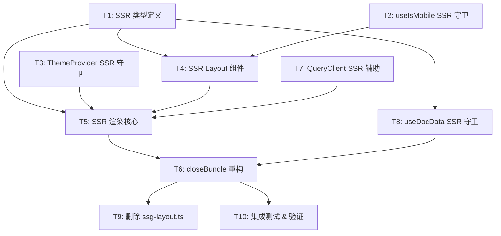

# SSR 渲染任务计划

## 依赖关系与并行策略

### 任务依赖图 (Mermaid)



### 并行组

- **并行组 1**：T1、T2、T3（无相互依赖，可并行执行）
- **并行组 2**：T7、T8（依赖 T1 完成）
- **并行组 3**：T4（依赖 T1、T2 完成）
- **串行链**：T5 → T6 → T9 → T10

## 任务列表

### T1: SSR 类型定义

- **ID**：`ssr-types`
- **标题**：创建 SSR 渲染相关的 TypeScript 类型定义
- **描述**：

  在 `src/types/ssg.ts` 中定义 SSR 渲染上下文所需的类型。

  1. 创建 `SsgRenderContext` 接口 — SSR 渲染所需的完整上下文数据：
     - `lang: string` — 当前语言
     - `currentPath: string` — 当前页面 URL 路径，如 `"/en/guide/getting-started"`
     - `onDocPage: boolean` — 是否为文档页面
     - `manifest?: DocManifest` — 文档清单（仅 doc 页面）
     - `headings?: TocHeading[]` — 目录标题列表（仅 doc 页面）
     - `translations: Record<string, string>` — UI 翻译扁平对象
     - `siteConfig: SiteConfig` — 站点配置

  2. 创建 `SsgLayoutProps` 接口 — SSR Layout 组件的 Props：
     - `context: SsgRenderContext`
     - `children: React.ReactNode`

  3. 创建 `SsgDocPageContext` 接口 — doc 页面额外的渲染上下文：
     - 继承 `SsgRenderContext`
     - `entry: SsgPageEntry` — 编译后的文章数据（SsgPageEntry 类型定义在 `vite-plugin-easydoc.ts` 中，需要提取到 `src/types/ssg.ts`）

  4. 从 `src/plugins/vite-plugin-easydoc.ts` 中提取 `SsgPageEntry` 接口到 `src/types/ssg.ts`。

  5. 新增 `src/types/ssg.ts` 文件，所有类型使用 `export interface` 命名导出。

- **Agent**：frontend-agent
- **Status**：pending
- **Spec Refs**：`spec/ssr-architecture.md`
- **Depends On**：无
- **Context Files**：
  - `src/types/doc.ts`（DocManifest, TocHeading, DocNavItem 等类型）
  - `src/types/config.ts`（SiteConfig 类型）
  - `src/types/hydration.ts`（HydrationData 类型）
  - `src/plugins/vite-plugin-easydoc.ts`（SsgPageEntry 内部类型）
- **Output Files**：
  - `src/types/ssg.ts`

---

### T2: useIsMobile SSR 守卫

- **ID**：`ssr-use-mobile-guard`
- **标题**：为 useIsMobile hook 添加 SSR 安全守卫
- **描述**：

  修改 `src/hooks/use-mobile.ts` 中的 `useIsMobile` hook，使其在 Node.js 环境（SSR）中安全运行。

  1. 在 hook 函数开头添加 SSR 守卫：若 `typeof window === 'undefined'`，直接返回 `false`
  2. 保持现有浏览器逻辑不变（`useEffect` + `matchMedia`）
  3. 导出接口和函数签名不变

  `useIsMobile` 返回 `boolean`。SSR 环境中固定返回 `false` 表示桌面端渲染模式，这与 SSG 策略一致（静态 HTML 按桌面端布局生成）。

- **Agent**：frontend-agent
- **Status**：pending
- **Spec Refs**：`spec/ssr-architecture.md`
- **Depends On**：无
- **Context Files**：
  - `src/hooks/use-mobile.ts`
- **Output Files**：
  - `src/hooks/use-mobile.ts`（修改）

---

### T3: ThemeProvider SSR 守卫

- **ID**：`ssr-theme-provider-guard`
- **标题**：为 ThemeProvider 添加 SSR 安全初始化
- **描述**：

  修改 `src/components/theme-provider.tsx`，使其在 Node.js 环境（SSR）中安全初始化。

  1. 在 `ThemeProvider` 组件内部，在初始化 `useState` 时添加 SSR 守卫：
     - 若 `typeof window === 'undefined'`，跳过 `localStorage.getItem(storageKey)`，直接使用 `defaultTheme`
  2. 在 `useEffect`（主题应用、键盘事件、storage 事件监听）中，所有 effect 本身在 SSR 时不执行（React 19 `renderToString` 不触发 effects），但为确保静态分析安全，可在每个 effect 开头添加 `typeof window === 'undefined'` 提前返回
  3. 导出接口和组件签名不变

- **Agent**：frontend-agent
- **Status**：pending
- **Spec Refs**：`spec/ssr-architecture.md`
- **Depends On**：无
- **Context Files**：
  - `src/components/theme-provider.tsx`
- **Output Files**：
  - `src/components/theme-provider.tsx`（修改）

---

### T4: SSR Layout 组件

- **ID**：`ssr-layout-component`
- **标题**：创建 SSR 专用 SsgLayout 组件
- **描述**：

  创建 `src/ssr/ssg-layout.tsx`，实现 SSR 环境下的布局组件。

  该组件是客户端 `src/components/Layout.tsx` 的 SSR 对标版本。关键差异：

  1. **不依赖路由 hooks**：不调用 `useLocation()`、`useParams()`、`<Outlet />`。路由信息通过 `SsgRenderContext` props 传入。
  2. **不依赖浏览器 API**：不调用 `useIsMobile()` — 直接使用 context 中的 `onDocPage` 决定是否渲染侧边栏。
  3. **不发起数据请求**：不调用 `useQuery` — 数据通过 `QueryClient.setQueryData` 预填充，`useQuery` 会自动从缓存读取。
  4. **直接渲染 children**：不使用 `<Outlet />`，改为 `{children}` 渲染传入的页面内容。

  组件结构：
  - 顶层：`DocContext.Provider`（提供空 headings/activeHeadingId，由子组件或 props 提供）
  - `SidebarProvider defaultOpen={onDocPage}`（SSR 固定 `isMobile=false`）
  - `div.flex.min-h-screen.flex-col.w-full`
    - `Header showSidebarTrigger={onDocPage}`
    - `div.flex.flex-1`
      - `DocSidebar`（仅当 `onDocPage && manifest`）
      - `SidebarInset` → `main` → `{children}`
      - `TocSidebar`（仅当 `onDocPage && headings && !isMobile`）
    - `Footer`

  Props 接口使用 `SsgLayoutProps`（在 T1 中定义）。

- **Agent**：frontend-agent
- **Status**：pending
- **Spec Refs**：`spec/ssr-architecture.md`
- **Depends On**：`ssr-types`、`ssr-use-mobile-guard`
- **Context Files**：
  - `src/components/Layout.tsx`（参考现有布局结构）
  - `src/components/Header.tsx`（了解 Header props）
  - `src/components/DocSidebar.tsx`（了解 DocSidebar props）
  - `src/components/TocSidebar.tsx`（了解 TocSidebar props）
  - `src/components/Footer.tsx`（了解 Footer 用法）
  - `src/components/DocContext` 相关（Layout.tsx 中的 DocContext）
  - `src/types/ssg.ts`（T1 产物，SsgLayoutProps）
  - `src/types/doc.ts`（DocManifest, TocHeading）
- **Output Files**：
  - `src/ssr/ssg-layout.tsx`

---

### T5: SSR 渲染核心

- **ID**：`ssr-render-core`
- **标题**：实现 SSR 渲染核心函数 renderDocPageToString 和 renderHomePageToString
- **描述**：

  创建 `src/ssr/ssg-render.tsx`，提供两个纯函数用于在 Node.js 构建环境中生成静态 HTML。

  **函数 1：`renderDocPageToString`**

  接收：`entry: SsgPageEntry`、`manifest: DocManifest`、`translations: Record<string, string>`、`siteConfig: SiteConfig`、`currentPath: string`、`hydrationData: HydrationData`

  内部步骤：
  1. 创建 `QueryClient` 实例
  2. 使用 `queryClient.setQueryData(docKeys.doc(lang, docPath), docPageData)` 预填充文档数据，使 `DocContent` 内依赖 `useDocData` 的组件可直接读取
  3. 使用 `queryClient.setQueryData(docKeys.manifest(lang), manifest)` 预填充 manifest
  4. 构造 JSX 元素树：
     ```
     <StaticRouter location={currentPath}>
       <QueryClientProvider client={queryClient}>
         <ThemeProvider defaultTheme="light" disableTransitionOnChange={false}>
           <TooltipProvider>
             <SidebarProvider defaultOpen={true}>
               <SsgLayout context={...}>
                 <DocContent html={entry.html} ... />
                 <DocNav prev={...} next={...} />
               </SsgLayout>
             </SidebarProvider>
           </TooltipProvider>
         </ThemeProvider>
       </QueryClientProvider>
     </StaticRouter>
     ```
  5. 调用 `renderToString(elementTree)` 得到 HTML 字符串
  6. 返回 HTML 字符串

  **函数 2：`renderHomePageToString`**

  接收：`homeHtml: string`、`translations: Record<string, string>`、`siteConfig: SiteConfig`、`lang: string`

  内部步骤：
  1. 创建空的 `QueryClient`
  2. 构造 JSX 元素树：
     ```
     <StaticRouter location={`/${lang}`}>
       <QueryClientProvider client={queryClient}>
         <ThemeProvider defaultTheme="light" disableTransitionOnChange={false}>
           <TooltipProvider>
             <SidebarProvider defaultOpen={false}>
               <SsgLayout context={...}>
                 <HeroSection />
                 <FeatureCards />
               </SsgLayout>
             </SidebarProvider>
           </TooltipProvider>
         </ThemeProvider>
       </QueryClientProvider>
     </StaticRouter>
     ```
  3. 调用 `renderToString(elementTree)` 得到 HTML 字符串
  4. 返回 HTML 字符串

  导入关系：
  - `renderToString` 从 `react-dom/server`
  - `StaticRouter` 从 `react-router-dom`
  - `QueryClient`、`QueryClientProvider` 从 `@tanstack/react-query`
  - `ThemeProvider` 从 `@/components/theme-provider`
  - `TooltipProvider` 从 `@/components/ui/tooltip`
  - `SidebarProvider` 从 `@/components/ui/sidebar`
  - `SsgLayout` 从 `./ssg-layout`
  - `DocContent` 从 `@/components/DocContent`
  - `DocNav` 从 `@/components/DocNav`
  - `HeroSection` 从 `@/components/HeroSection`
  - `FeatureCards` 从 `@/components/FeatureCards`
  - `docKeys` 从 `@/services/docService`

- **Agent**：frontend-agent
- **Status**：pending
- **Spec Refs**：`spec/ssr-architecture.md`
- **Depends On**：`ssr-types`、`ssr-layout-component`、`ssr-theme-provider-guard`、`ssr-use-mobile-guard`
- **Context Files**：
  - `src/ssr/ssg-layout.tsx`（T4 产物，SSR Layout 组件）
  - `src/types/ssg.ts`（T1 产物）
  - `src/types/doc.ts`（DocManifest, DocPageData, TocHeading, DocNavRef）
  - `src/types/config.ts`（SiteConfig）
  - `src/types/hydration.ts`（HydrationData）
  - `src/services/docService.ts`（docKeys）
  - `src/components/theme-provider.tsx`
  - `src/components/ui/tooltip.tsx`
  - `src/components/ui/sidebar.tsx`
  - `src/components/DocContent.tsx`
  - `src/components/DocNav.tsx`
  - `src/components/HeroSection.tsx`
  - `src/components/FeatureCards.tsx`
- **Output Files**：
  - `src/ssr/ssg-render.tsx`

---

### T6: closeBundle 重构

- **ID**：`ssr-closeBundle-refactor`
- **标题**：重构 vite-plugin-easydoc 的 closeBundle 钩子，用 SSR 渲染替换手工字符串拼接
- **描述**：

  修改 `src/plugins/vite-plugin-easydoc.ts` 的 `closeBundle` 钩子。

  变更内容：

  1. **移除旧导入**：删除 `import { renderDocLayout, renderHomeLayout } from './ssg-layout'`

  2. **新增导入**：添加 `import { renderDocPageToString, renderHomePageToString } from '../ssr/ssg-render'`

  3. **Doc 页面 SSG 部分**：
     - 在循环中，替换：
       ```typescript
       const fullLayoutHtml = renderDocLayout(entry, manifest, translations, siteConfig, currentPath);
       ```
       为：
       ```typescript
       const hydrationData: HydrationData = { /* 已有逻辑，移到此处构造 */ };
       const fullLayoutHtml = renderDocPageToString(entry, manifest, translations, siteConfig, currentPath, hydrationData);
       ```
     - 注意：原先 `applySsgTransform` 内部构造 hydrationData，现在该逻辑需要调整顺序 — 先在循环中构造 hydrationData 再调用 SSR 渲染

  4. **Home 页面 SSG 部分**：
     - 替换：
       ```typescript
       const fullHomeHtml = renderHomeLayout(homeHtml, translations, siteConfig, lang);
       ```
       为：
       ```typescript
       const fullHomeHtml = renderHomePageToString(homeHtml, translations, siteConfig, lang);
       ```

  5. **`applySsgTransform` 函数调整**：
     - 原先 `applySsgTransform` 接收 `fullLayoutHtml` 参数，现在改为接收已渲染好的完整 HTML
     - 函数签名可能需要微调，但核心逻辑（SEO meta 替换、hydration script 注入、文件写入）不变

  **关键注意事项**：
  - `tsx` 转译问题：`closeBundle` 钩子在 Node 中执行，动态 `import('../ssr/ssg-render')` 需要能被正确转译。解决方案：使用 Vite 的 `ssrLoadModule` 或确保 `tsx` 已在构建流程中注册
  - 实际上，由于 Vite 在构建时已经将所有源码转译为 ESM，且 `closeBundle` 在 Rollup 完成后执行，可以通过使用 Vite 内部 API 或确保 Node 可以解析 TSX 文件来加载 SSR 模块

- **Agent**：frontend-agent
- **Status**：pending
- **Spec Refs**：`spec/ssr-architecture.md`
- **Depends On**：`ssr-render-core`
- **Context Files**：
  - `src/plugins/vite-plugin-easydoc.ts`（全部内容）
  - `src/plugins/ssg-home.ts`（buildSeoMetaString, buildHomeSeoMeta, generateHomePageHtml）
  - `src/i18n/static.ts`（getTranslations）
  - `src/types/hydration.ts`（HydrationData, HomeHydrationData）
  - `src/types/seo.ts`（SeoMeta）
  - `src/types/doc.ts`（DocNavRef）
  - `src/ssr/ssg-render.tsx`（T5 产物）
- **Output Files**：
  - `src/plugins/vite-plugin-easydoc.ts`（修改）

---

### T7: 删除 ssg-layout.ts

- **ID**：`ssr-delete-old-layout`
- **标题**：删除旧的手工字符串拼接布局文件
- **描述**：

  删除 `src/plugins/ssg-layout.ts` 文件（约 290 行）。

  该文件中的所有功能已被 SSR 渲染方案替代：
  - `renderDocLayout()` → `renderDocPageToString()`
  - `renderHomeLayout()` → `renderHomePageToString()`
  - 所有内部辅助函数（`renderHeader`、`renderFooter`、`renderDocSidebar`、`renderTocSidebar`、`renderDocSidebarItems`、`renderDesktopNavItem`、`renderMobileNavContent` 等）不再需要

  在删除前需确认：
  - `vite-plugin-easydoc.ts` 中已无对此文件的 import
  - 没有其他文件引用此模块的导出

- **Agent**：frontend-agent
- **Status**：pending
- **Spec Refs**：`spec/ssr-architecture.md`
- **Depends On**：`ssr-closeBundle-refactor`
- **Context Files**：
  - `src/plugins/vite-plugin-easydoc.ts`（确认 import 已移除）
- **Output Files**：
  - `src/plugins/ssg-layout.ts`（删除）

---

### T8: 集成测试与验证

- **ID**：`ssr-integration-test`
- **标题**：构建测试验证 SSR 渲染输出与客户端 hydration 的一致性
- **描述**：

  执行完整的 `pnpm build` 构建，验证以下项目：

  1. **构建成功**：`vite build` 无错误退出
  2. **SSG 页面生成**：`dist/en/`、`dist/zh/` 下存在所有预期的 `.html` 文件
  3. **HTML 结构验证**：抽样检查生成的 HTML 文件：
     - `<div id="root">` 中包含与 React 客户端渲染一致的 DOM 结构
     - 包含 `data-sidebar="sidebar"`、`data-slot="sidebar-wrapper"` 等 shadcn/ui 标记属性
     - Header 包含 logo 链接、导航菜单、搜索触发器
     - Footer 包含版权信息和链接
  4. **Hydration 数据验证**：检查 `window.__HYDRATION_DATA__` 脚本标签存在且 JSON 格式正确
  5. **SEO meta 验证**：检查 `<title>` 和 `<meta>` 标签正确
  6. **CSS 类名一致性**：SSR 生成的 HTML 中的 Tailwind 类名与客户端组件一致

  如果发现问题，需要定位并修复对应的 SSR 组件或渲染逻辑中的问题。

- **Agent**：frontend-agent
- **Status**：pending
- **Spec Refs**：`spec/ssr-architecture.md`
- **Depends On**：`ssr-closeBundle-refactor`、`ssr-delete-old-layout`
- **Context Files**：无（验证任务，读取构建产物）
- **Output Files**：无（验证任务，不产生代码变更，但在发现问题时可能需要修改之前的产物文件）